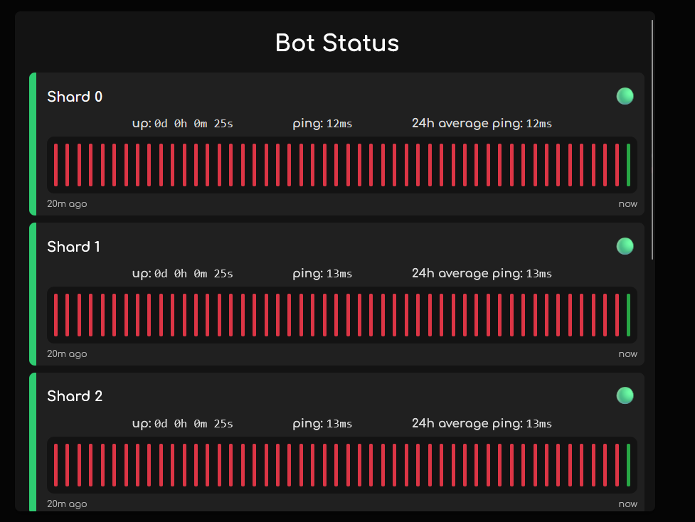

# discord-bot-status  
Simple and fast web app with an API to let your users know if the bot is up or down.  

## Photos 



## How to install?

### Normal

- Prerequisites
    - Bun version 1.2.3 and more - [install here](https://bun.sh/docs/installation)
    - A computer 🔥

- Clone the repo
```git clone https://github.com/MaitreGEEK/discord-bot-status.git```

- Then go to the repo you just cloned 
```cd discord-bot-status```

- Install the dependencies (one lmao)
```bun install```

- Modifies the settings either in a [.env](.env.example) either in [specificConfig.json](./specificConfig.json.example)

- Run the app
```bun run app.js```

- It will be on http://localhost:6071/ by default

### Dockerfile
Use the dockerfile to create a docker of the app

## Routes  
*$ means they will require a token to work, set the token in .env or in specificConfig.json and then add it in headers Authorization: Bearer {token}*

- `GET /shard/:shardId` → Returns the status of the shard
- $ `POST /shard/:shardId` → Modifies the status of the shard *Creates the shard if it doesn’t exist*  
- $ `DELETE /shard/:shardId` → Deletes the shard

- `GET /shards` → Returns the status of all shards
- $ `POST /shards` → Updates a bunch of shards at the same time - each shard should have at least an id property, it will update to up by default 
- $ `DELETE /shards` → Returns to reset as it's the same thing

- $ `DELETE /reset` → Resets the database

- `GET /status` → Status page displaying all shards and their states  

- `GET /styles.css` → CSS stylesheet for the website
- `GET /favicon.ico` → icon for the website

## ENV variables

- ENV API_PORT - changes the port of the app by default 6071
- ENV API_URL - changes the url of the app by default localhost (it's only for cosmetic)
- ENV DATABASE_PATH - changes the path of the database by default ./shards.db
- ENV TOKEN - changes the token for the application by default NULL (IT'S IMPORTANT TO CHANGE IT)
- ENV RESPONSE_PERIOD - period in seconds which the application will check if the bot's up or not, by default 60

## Functionality  

- SQLite database
- Uses `Bun.serve` for the server

- A shard will look like this : 
```
id: its id, for non shards apps it will always be 0
uptime: timestamp from when it was last up
ping: in ms 
status: down or up
last24hpings: an array of objects with all the pings from the last 24h with their timestamp
last24hevents: an array of objects with all the status from the last 24h with their timestamp
server: optional where this shard is hosted
version: this shard version (if your bot has versions enabled it's a good idea to have this so you can know if some shards are in new or old versions)
```

## Files  

- `app.js`  
- `functions.js`  
- `styles.css`  
- `package.json`